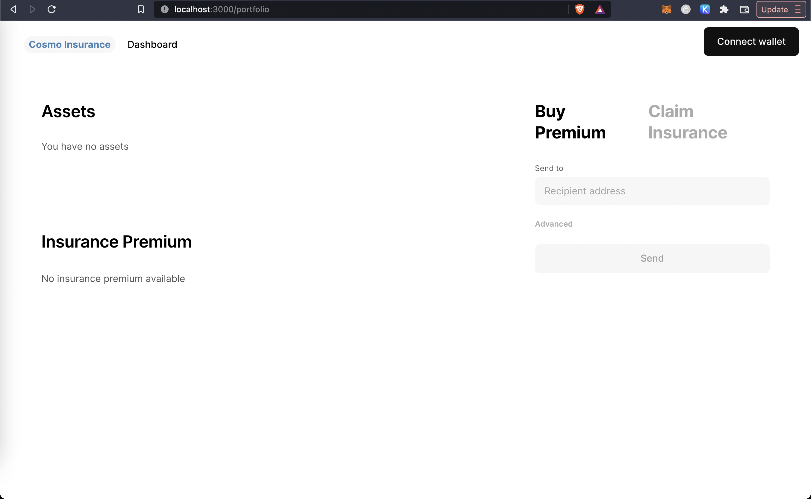
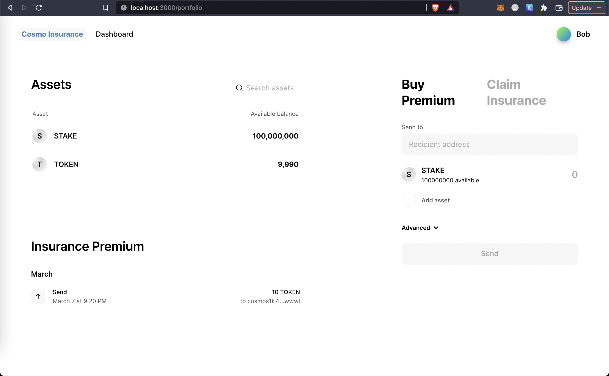
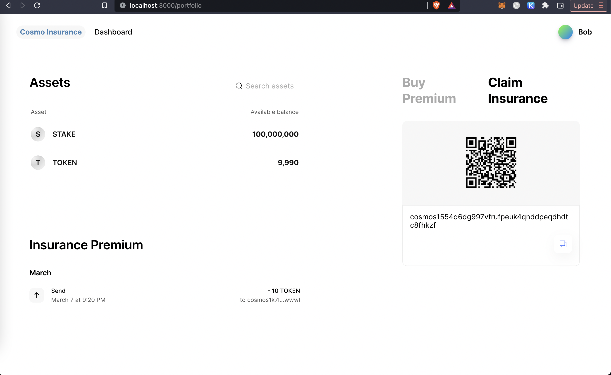
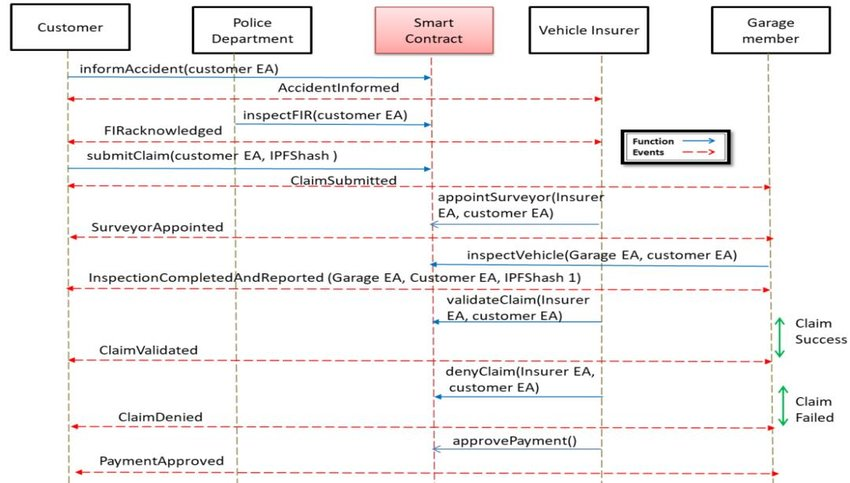

# Cosmos Insurance

The Cosmos Insurance Application allows the clients to purchase insurance using one cryptocurrency and the insurance provider performs claims settlements using a different cryptocurrency. This is possible by harnessing the ability of Cosmos Blockchain to enable cross-platform transactions between different blockchains.

# Introduction

Insurance is a vital aspect of modern society, protecting individuals and businesses against financial loss. However, traditional insurance solutions are often expensive, slow, and difficult to access. Blockchain technology has emerged as a potential solution to these challenges, offering a decentralized, transparent, and secure platform for managing insurance policies and claims.

The Cosmos blockchain and Ignite Command Line Interface (CLI) provide a powerful combination for building insurance-based applications that leverage the benefits of blockchain technology. In this documentation, we will discuss an insurance-based application built using Cosmos blockchain and Ignite CLI, its use case, and how it works.

# Overview

The insurance-based application built using Cosmos blockchain and Ignite CLI aims to provide a decentralized platform for managing insurance policies and claims. The application will utilize the Tendermint consensus engine, which provides fast and secure consensus for the Cosmos blockchain.

The application will consist of two primary components: the insurance policy management system and the claims management system. The insurance policy management system will allow users to create and manage insurance policies, while the claims management system will allow users to file and manage insurance claims.

The insurance policy management system will enable users to create different types of insurance policies such as health insurance, travel insurance, property insurance, etc. Users will be able to select the type of insurance policy they wish to create, provide details about the policyholder, and define the terms and conditions of the policy.

The policy management system will also allow users to view their current policies, renew policies, and make changes to existing policies.The claims management system will enable users to file insurance claims and track the status of their claims. Users will be able to provide details about the claim, such as the type of insurance policy, the date of the incident, and any supporting documentation. The claims management system will also allow users to view the status of their claims, including whether the claim has been approved, denied, or is still under review.

# Use Case

The insurance-based application built using Cosmos blockchain and Ignite CLI has several potential use cases, including:

- Decentralized Insurance Policies: The application provides a decentralized platform for managing insurance policies, enabling individuals and businesses to create and manage policies without relying on traditional insurance providers. This can be especially useful for individuals or small businesses that may not have access to traditional insurance providers or have been denied coverage.

- Transparency and Trust: The use of blockchain technology ensures that all transactions related to insurance policies and claims are transparent and secure. This can help to build trust between policyholders and insurance providers, as all parties can verify the authenticity of transactions and claims.

- Faster Claims Processing: The use of blockchain technology can help to speed up the claims processing time by providing a secure and transparent platform for processing claims. This can help to reduce the administrative burden on insurance providers and improve the overall customer experience.

- Lower Costs: The use of a decentralized platform for managing insurance policies and claims can help to reduce costs by eliminating the need for intermediaries and reducing administrative overhead.

# Application Flow

The insurance-based application built using Cosmos blockchain and Ignite CLI works as follows:

- User creates a new insurance policy by providing details such as the policyholder's name, type of insurance policy, and terms and conditions.
- The policy management system creates a new policy on the blockchain and assigns a unique policy ID to the policy.
- The policy management system notifies the user that the policy has been created and provides them with the policy ID.
- The user can view their policy details and make changes to the policy as needed.
- User files an insurance claim by providing details such as the type of insurance policy, the date of the incident, and any supporting documentation.
- The claims management system creates a new claim The claims management system creates a new claim on the blockchain and assigns a unique claim ID to the claim.
- The claims management system notifies the user that the claim has been filed and provides them with the claim ID.
- The claims management system initiates the claims review process, which includes verifying the authenticity of the claim and determining the appropriate payout amount.
- Once the claim has been approved, the claims management system initiates the payout process by transferring funds from the insurer's account to the policyholder's account.
- The claims management system updates the status of the claim on the blockchain and notifies the user that the claim has been approved and the funds have been transferred.
- If the claim is denied, the claims management system updates the status of the claim on the blockchain and notifies the user that the claim has been denied and the reason for the denial.

The use of the Cosmos blockchain and Ignite CLI provides several benefits for the insurance-based application, including:

- Decentralization: The use of a decentralized platform ensures that all transactions related to insurance policies and claims are transparent and secure, and eliminates the need for intermediaries.

- Fast and Secure Transactions: The Tendermint consensus engine used by the Cosmos blockchain provides fast and secure consensus, ensuring that all transactions are processed quickly and accurately.

- Customizability: The Ignite CLI provides a customizable framework for building blockchain-based applications, enabling developers to create customized solutions that meet the specific needs of their users.

- Scalability: The Cosmos blockchain is highly scalable, allowing the insurance-based application to handle large volumes of transactions without compromising performance or security.

# Application Screenshots

## Before connecting wallet

  

## Buy Insurance

  

## Claim Insurance

  

# Sequence Diagram for the Insurance-Based Application

The following sequence diagram illustrates the flow of events in the insurance-based application:

  

# Conclusion

The insurance-based application built using Cosmos blockchain and Ignite CLI provides a decentralized, transparent, and secure platform for managing insurance policies and claims. The use of blockchain technology ensures that all transactions related to insurance policies and claims are transparent and secure, enabling individuals and businesses to create and manage policies without relying on traditional insurance providers. The use of the Tendermint consensus engine provides fast and secure consensus, ensuring that all transactions are processed quickly and accurately. The Ignite CLI provides a customizable framework for building blockchain-based applications, enabling developers to create customized solutions that meet the specific needs of their users. Overall, the insurance-based application built using Cosmos blockchain and Ignite CLI has the potential to revolutionize the insurance industry, making insurance policies and claims management faster, more efficient, and more accessible for everyone.

Cosmos blockchain is a highly scalable, customizable, and interoperable blockchain platform that is well-suited for building insurance-based applications.

Here are some reasons why Cosmos blockchain is better suited for an insurance-based application over other blockchain platforms:

- Scalability: One of the main challenges of building blockchain-based applications is scalability. Many blockchain platforms, such as Bitcoin and Ethereum, are limited in their ability to handle large volumes of transactions. Cosmos blockchain, on the other hand, is highly scalable and can handle thousands of transactions per second. This makes it ideal for building insurance-based applications that require fast and efficient processing of large volumes of transactions.

- Customizability: Cosmos blockchain is highly customizable, which means that developers can create customized solutions that meet the specific needs of their users. This is important for building insurance-based applications, as insurance policies and claims management can vary widely depending on the specific needs of the policyholders.

- Interoperability: Cosmos blockchain is designed to be interoperable with other blockchain platforms, which means that it can communicate with other blockchains and share data between them. This is important for insurance-based applications, as it enables policyholders to access and manage their policies across different blockchain networks.

- Security: Cosmos blockchain is highly secure, thanks to its use of the Tendermint consensus algorithm, which ensures that all transactions are processed quickly and accurately, while also preventing double-spending and other forms of fraud. This is important for insurance-based applications, as it ensures that all policyholders' data and transactions are protected from unauthorized access and manipulation.

- Governance: Cosmos blockchain has a robust governance system that enables stakeholders to participate in decision-making and vote on changes to the network. This is important for insurance-based applications, as it ensures that policyholders have a voice in how the network is managed and developed.

Overall, Cosmos blockchain is well-suited for building insurance-based applications due to its scalability, customizability, interoperability, security, and governance features. Its ability to handle large volumes of transactions, while also providing customizable solutions for insurance policies and claims management, makes it a highly attractive option for developers looking to build blockchain-based insurance applications.
